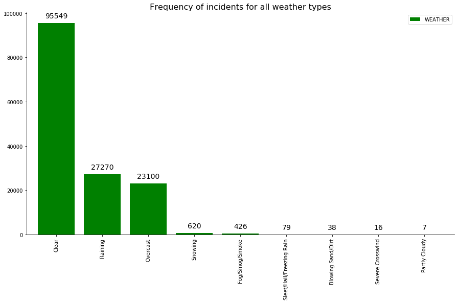
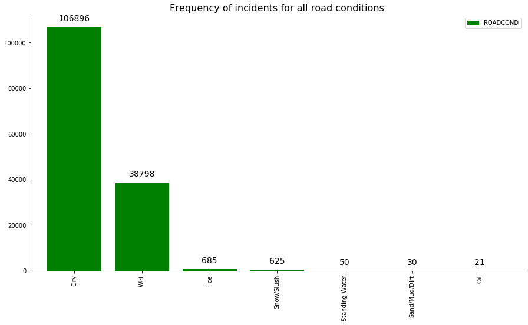

# Capstone Project - Car Accident Severity Prediction
## Introduction: Business Understanding

Road accidents lead to fatalities and economic losses. Thus, <b>preventing loss of life and property</b> is a topic of concern.  

The Seattle government can deploy a system that can alert drivers, health system, and police to remind them to practice caution and alertness in case of an incident. As a step towards this solution I will be building a model than will <b>predict the severity of an accident.</b>  

This model can be the <b>driving mechanism</b> that could <b>warn people</b>, given the weather and the road conditions about the <b>possibility of a car accident and how severe</b> it would be, so that they would <b>drive more carefully or even change their travel</b> if possible.  

In accident severity modeling, the <b>input vectors</b> are the characteristics of the accident, such as <b>driver behavior and attributes of vehicle, highway and environment characteristics</b> while the <b>output vector</b> is the corresponding <b>class of accident severity.</b> 

By recognizing the <b>key factors that influence accident severity</b>, the solution may be of great utility to various <b>Government Departments/Authorities like Police, R&B and Transport</b> from public policy point of view.  

The results of analysis and modeling can be used by these Departments to take appropriate measures to <b>reduce accident impact</b> and thereby <b>improve traffic safety</b>. It is also useful to the Insurers in terms of reduced claims and better underwriting as well as rate making.

## Data
These traffic records were collected by the <b>SPD (Seattle Police Department).</b>  
The time-frame of this data is from <b>2004 to present.</b> 
The data consists of <b>37 attributes and 194,673 collision records</b>.  
The dependent variable, <b>“SEVERITYCODE”</b>, contains numbers that correspond to different <b>levels of severity</b> caused by an accident from 0 to 4.

<b>Severity codes are as follows:
- 0: Little to no Probability (Clear Conditions)
- 1: Very Low Probability — Chance or Property Damage
- 2: Low Probability — Chance of Injury
- 2b: Mild Probability — Chance of Serious Injury
- 3: High Probability — Chance of Fatality</b>
Following is a table of all the attributes along with their data types, variable length and a description for understanding.  This Meta-data is provided by the <b>SDOT Traffic Management Division.</b>

|Attribute          |Data type, length| Description                                                 |
|:------------------|:----------------|:------------------------------------------------------------|
|LOCATION           | Text, 255       |Description of the general location of the collision         | 
|EXCEPTRSNCODE      | Text, 10        |                                                             |
|EXCEPTRSNDESC      | Text, 300       |                                                             |
|SEVERITYCODE       | Text, 100       |A code that corresponds to the severity of the collision:
|                   |                 |3—fatality, 2b—serious injury, 2—injury, 1—prop damage,0—unknown|
|SEVERITYDESC       |Text             |A detailed description of the severity of the collision|
|COLLISIONTYPE      |Text, 300        |Collision type|
|PERSONCOUNT        |Double           |The total number of people involved in the collision|
|PEDCOUNT           |Double           |The number of pedestrians involved in the collision. |
|PEDCYLCOUNT        |Double           |The number of bicycles involved in the collision.|
|VEHCOUNT           |Double           |The number of vehicles involved in the collision.|
|INJURIES           |Double           |The number of total injuries in the collision.|
|SERIOUSINJURIES    |Double           |The number of serious injuries in the collision.|
|FATALITIES         |Double           |The number of fatalities in the collision.|
|INCDATE            |Date             |The date of the incident.|
|INCDTTM            |Text, 30         |The date and time of the incident.|
|JUNCTIONTYPE       |Text, 300        |Category of junction at which collision took place|
|SDOT_COLCODE       |Text, 10         |A code given to the collision by SDOT.|
|SDOT_COLDESC       |Text, 300        |A description of the collision corresponding to the collision code.|
|INATTENTIONIND     |Text, 1          |Whether or not collision was due to inattention.(Y/N)|
|UNDERINFL          |Text, 10         |Whether or not a driver involved was under the influence of drugs or alcohol.| 
|WEATHER            |Text, 300        |A description of the weather conditions during the time of the collision.|
|ROADCOND           |Text, 300        |The condition of the road during the collision.|
|LIGHTCOND          |Text, 300        |The light conditions during the collision.|
|PEDROWNOTGRNT      |Text, 1          |Whether or not the pedestrian right of way was not granted. (Y/N)|
|SDOTCOLNUM         |Text, 10         |A number given to the collision by SDOT.|
|SPEEDING           |Text, 1          |Whether or not speeding was a factor in the collision. (Y/N)|
|ST_COLCODE         |Text, 10         |A code provided by the state that describes the collision|
|ST_COLDESC         |Text, 300        |A description that corresponds to the state’s coding designation.|
|SEGLANEKEY         |Long             |A key for the lane segment in which the collision occurred.|
|CROSSWALKKEY       |Long             |A key for the crosswalk at which the collision occurred.|
|HITPARKEDCAR       |Text, 1          |Whether or not the collision involved hitting a parked car. (Y/N) |

<H4> As observed in the meta-data the severity code has 4 classes. Thus, this is a multi-class regression problem. 
I intend to build a machine learning model to predict the severity and classify it into the multi-class severity codes for public undertanding </H4>

## Methodology

For this project, I have used Github repository to commit changes and updation of my code and running Jupyter Notebook to preprocess data and build Machine Learning models. I have used Python for coding and its popular packages such as Pandas, NumPy and Sklearn. Matplotlib, pyplot, seaborn for visulizations. Standard scaler for data normaliztion, Classification reports as an evaluation metric. 

### Data Pre-processing
The collisions dataset has been sourced from the <b>Seattle Open GeoData Portal</b> and is updated weekly, thus a several unique identifiers and spatial features are present in the dataset which will be irrelevant in further statistical analysis and model building.   

Features like <b>OBJECTID, INCKEY, COLDETKEY, INTKEY and REPORTNO.</b> are the unique identifiers 

Features like <b>EXCEPTRSNCODE, EXCEPTRSNDESC and LOCATION</b> won't be contributing to our dataset.  
The LOCATION data will help us in populating the maps and getting the count in a particular area but the lattitudes and logitudes and already in place to serve that purpose. 

Features like <b>INCDATE - Incident Date and INCDTTM - Incident Timestamp </b>, The timestamp column doesn't have consistent values. Most values do not contain the time. Let's maintain the incident date from INCDATE column 

Features like <b>SDOT_COLCODE and SDOT_COLDESC</b> are redundant, <b>ST_COLCODE, ST_COLDESC, SDOT_COLNUM </b> are the repeated features which shouldn't be considered in further analysis  

Feature like <b>COLLISIONTYPE</b> has some missing values, those can be filled by mapping the SDOT_COLDESC values, SDOT_COLDESC involves the collision description and can be used alongwith the SDOT_COLCODE to input null values. 

Features like <b>JUNCTIONTYPE, WEATHER, ROADCOND, LIGHTCOND</b> contain null values, it would be best to drop these rows. 

Features like <b>INATTENTIONIND, UNDERINFL, SPEEDING</b> are variables with binary values and has values input for only one class. Thus, we can induce the either value to account for all the blank cells.  

Feature <b>PEDROWNOTGRNT</b> has 95% null values and considering it for model building would create bias, thus its safe to exclude it.

Features like <b>SEGLANEKEY, CROSSWALKKEY, HITPARKEDCAR </b> should be examined, if they aren't correlated to the target variable then they should be excluded, it can be conceived as noise.

After all these processing, I have considered 19 attributes for the further <b>Exploratory Data Analysis </b> 

 

